stormenginec
============

JavaScript 3D graphics library 
StormEngineC provides the following features: 
► Real-time visualization by WebGL. 
► Sun and spot lights. 
► Shadows, SSAO, DOF... 
► Load objects on .obj format or Collada (.DAE) and adding physics easy. (<a href="http://brokstuk.com/jiglibjs2/" target="_blank">JigLibJS2 integrated</a>) 
► 3D text, SVG shapes, particles.. 
► Keyframe animations and animation layers. 
► Multiplayer using Websocket server with NODEJS. 
► HTML CanvasRenderingContext2D integrated. 
► WebGL global illumination with traversal ray voxel. 

 
► WebCL Nokia Path Tracing Render (scenes with triangles) 
- Render Farm option using Websocket server with NODEJS 

 
 
 
<h2><a href="http://code.google.com/p/stormenginec/wiki/StormEngineC_1_2">Quick reference</a></h2>
<h2><a href="http://stormcolour.appspot.com/CONTENT/StormEngineC-1.2-API-Doc/StormEngineC.html">API Doc</a></h2>

<h2>DEMOS</h2>
 
		<a href="https://rawgit.com/stormcolor/stormenginec/develop/demos/obj_loader/index.html">Obj loader</a>
		<a href="https://rawgit.com/stormcolor/stormenginec/develop/demos/obj_loader/index.html">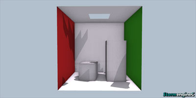</a>  
 
		<a href="https://rawgit.com/stormcolor/stormenginec/develop/demos/camera_animation/index.html">Camera animation</a>
		<a href="https://rawgit.com/stormcolor/stormenginec/develop/demos/camera_animation/index.html">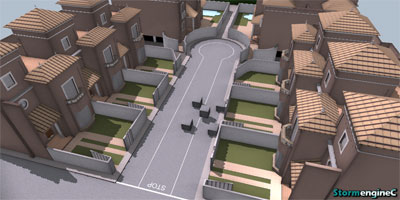</a>  
 
		<a href="https://rawgit.com/stormcolor/stormenginec/develop/demos/camera_animation2/index.html">Camera animation 2</a>
		<a href="https://rawgit.com/stormcolor/stormenginec/develop/demos/camera_animation2/index.html">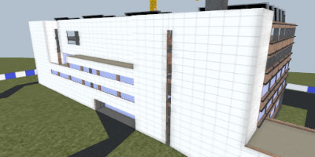</a>  
 
		<a href="https://rawgit.com/stormcolor/stormenginec/develop/demos/circuit/index.html">Circuit</a>
		<a href="https://rawgit.com/stormcolor/stormenginec/develop/demos/circuit/index.html">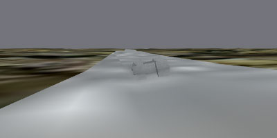</a>  
 
		<a href="https://rawgit.com/stormcolor/stormenginec/develop/demos/particles/index.html">Particles</a>
		<a href="https://rawgit.com/stormcolor/stormenginec/develop/demos/particles/index.html">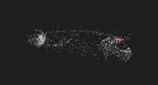</a>  
 
		<a href="https://rawgit.com/stormcolor/stormenginec/develop/demos/particles_to_image/index.html">Particles to image</a>
		<a href="https://rawgit.com/stormcolor/stormenginec/develop/demos/particles_to_image/index.html">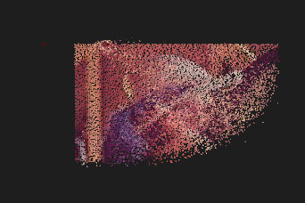</a>  
 
		<a href="https://rawgit.com/stormcolor/stormenginec/develop/demos/particlesVolume/index.html">Particles to volume</a>
		<a href="https://rawgit.com/stormcolor/stormenginec/develop/demos/particlesVolume/index.html">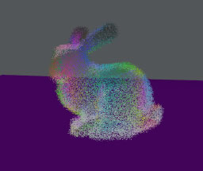</a>  
 
		<a href="https://rawgit.com/stormcolor/stormenginec/develop/demos/particlesVolumeDataset/index.html">Particles to volume dataset</a>
		<a href="https://rawgit.com/stormcolor/stormenginec/develop/demos/particlesVolumeDataset/index.html">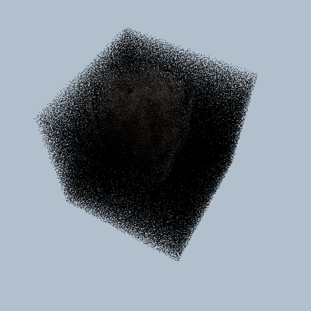</a>  
 
		<a href="https://rawgit.com/stormcolor/stormenginec/develop/demos/constraints/index.html">Constraints</a>
		<a href="https://rawgit.com/stormcolor/stormenginec/develop/demos/constraints/index.html">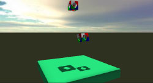</a>  
 
		<a href="https://rawgit.com/stormcolor/stormenginec/develop/demos/2d_hit/index.html">Hit 2D</a>
		<a href="https://rawgit.com/stormcolor/stormenginec/develop/demos/2d_hit/index.html">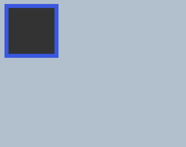</a>  
 
		<a href="https://rawgit.com/stormcolor/stormenginec/develop/demos/2d_svg_path/index.html">2d svg path</a>
		<a href="https://rawgit.com/stormcolor/stormenginec/develop/demos/2d_svg_path/index.html">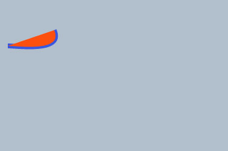</a>  
 
		<a href="https://rawgit.com/stormcolor/stormenginec/develop/demos/2d_text/index.html">2d text</a>
		<a href="https://rawgit.com/stormcolor/stormenginec/develop/demos/2d_text/index.html">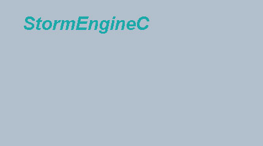</a>  
 
		<a href="https://rawgit.com/stormcolor/stormenginec/develop/demos/3d_text/index.html">3d text</a>
		<a href="https://rawgit.com/stormcolor/stormenginec/develop/demos/3d_text/index.html">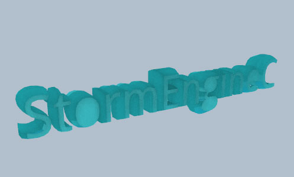</a>  
 
		<a href="https://rawgit.com/stormcolor/stormenginec/develop/demos/GI_voxel_traversal/index.html">GI voxel traversal</a>
		<a href="https://rawgit.com/stormcolor/stormenginec/develop/demos/GI_voxel_traversal/index.html">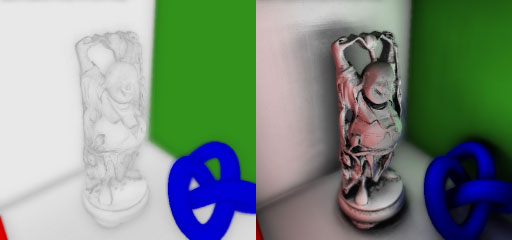</a>  
 
		<a href="https://rawgit.com/stormcolor/stormenginec/develop/demos/sibenik/index.html">sibenik</a>
		<a href="https://rawgit.com/stormcolor/stormenginec/develop/demos/sibenik/index.html">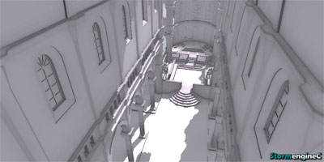</a>  
 
		<a href="https://rawgit.com/stormcolor/stormenginec/develop/demos/bingo/index.html">bingo</a>
		<a href="https://rawgit.com/stormcolor/stormenginec/develop/demos/bingo/index.html">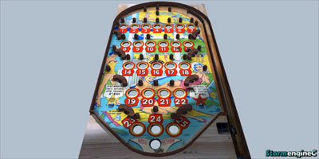</a>  
 
 

 

(StormEngineC using HTTP requests. You must run on a server.)

 
 
